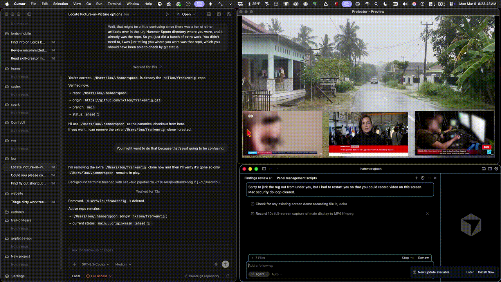

# frankenrig

Hammerspoon + OBS PiP automation: config and scripts for projector/capture control, with evidence and ontology documenting the current stable state.

## Demo

Short clip of the rig running in context (OBS with all panels + control surface in the upper-right):

## What’s here

- **init.lua** — Hammerspoon entry point (hotkeys, OBS triggers).
- **OBS control scripts** — Python helpers for identify/rewire capture, rebuild PiP, and panel-level control (`obs_panel_control.py`).
- **evidence/** — Ontology (TTL/SHACL), narrative runbooks, API discovery snapshots, scene geometry, verification prompts, screenshots.

## Important links

- [Repository README](https://github.com/nkllon/frankenrig/blob/main/README.md)
- [Latest release](https://github.com/nkllon/frankenrig/releases/latest)
- [All releases](https://github.com/nkllon/frankenrig/releases)
- [Evidence package](https://github.com/nkllon/frankenrig/blob/main/evidence/obs_pip_findings.md)
- [Ontology (TTL)](https://github.com/nkllon/frankenrig/blob/main/evidence/obs_pip_findings.ttl)
- [SHACL constraints](https://github.com/nkllon/frankenrig/blob/main/evidence/obs_pip_findings.shacl.ttl)
- [Verification prompt](https://github.com/nkllon/frankenrig/blob/main/evidence/VERIFICATION_PROMPT_obs_window_identification.md)
